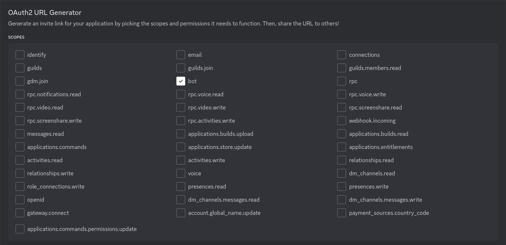
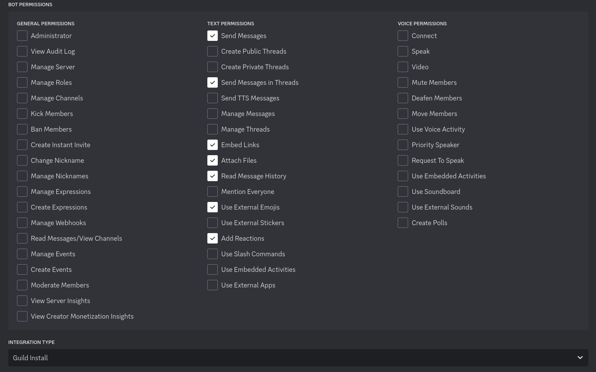

# Setting up a development environment

Before making any changes to a codebase, it's crucial to test them in a safe environment before pushing them to production. This document is a (very long) guide to setting up such an environment on your own computer, from installing packages to creating platform accounts.

## Preliminaries

The bot runs on an Amazon Web Services (AWS) [EC2 instance](https://aws.amazon.com/ec2). AWS is highly reliable, runs 24/7, and most importantly allows us to dynamically scale the resources as necessary. When I first joined the CTM server, it was quite literally less than 1% of its current size. This bot started out on Twitch only, without a `!summon` command, and was in only one channel aside from [its own](https://www.twitch.tv/classictetrisbot): the [ClassicTetris channel](https://www.twitch.tv/classictetris). Today, it is in over 500. Scalability is important - as the Tetris community continues to grow (and as this project and the corresponding [website](https://monthlytetris.info) do so alongside it), we will need room to expand not only the software but the hardware infrastructure as well.

The AWS instance is running under the Ubuntu 18.04 LTS server distribution, but for development, I'm confident that any \*nix operating system will do (which includes MacOS). However, if you have Windows, you may consider [Windows Subsystem for Linux (WSL)](https://docs.microsoft.com/en-us/windows/wsl/install-win10), which allows you to run many Linux distributions, including Ubuntu 16.04 and 18.04, from your Windows machine. WSL can be finicky, but it works well enough for this.

Once you have access to sudo privileges in a bash command line with which you are relatively comfortable, you can proceed. For the following instructions, I use `apt` as a package manager, but you may replace that with whatever your operating system uses (`dnf`, `yum`, `pacman`, and `brew` are a few examples).

## Setup

### Development dependencies

Begin, if you haven't already, by installing the necessary packages with your package manager. For example, on Ubuntu you can run

```bash
sudo apt install python3.8 python3.8-dev python3-pip sqlite3 libsqlite3-dev redis-server
```

For redis, you may have to do more work to actually run the server (or configure it to run automatically), I actually don't know what the installation experience is like on most platforms.

For a robust development environment, next, using Python's package manager [pip](https://pip.pypa.io/en/stable), we install [virtualenvwrapper](https://virtualenvwrapper.readthedocs.io/en/latest), which is "a set of extensions" of another Python tool called virtualenv. Its benefits are numerous, but most notably it elegantly (and quietly) deals with versioning of all dependencies, as well as of Python itself, within our development and production environments. Install it like so:

```bash
sudo pip install virtualenvwrapper
source /usr/local/bin/virtualenvwrapper.sh
```

Alternatively, with Python 3:

```bash
sudo pip3 install virtualenvwrapper
VIRTUALENVWRAPPER_PYTHON="/usr/bin/python3"
source /usr/local/bin/virtualenvwrapper.sh
```

You'll probably want to add `source /usr/local/bin/virtualenvwrapper_lazy.sh` to your equivalent of a [bashrc](https://www.digitalocean.com/community/tutorials/bashrc-file-in-linux) so it's always available.

### Directory and Virtualenv Setup

Now, make sure you're logged in to your GitHub account, and **fork this repository** using the button at the top right of this page. This will create a *copy* of the repository on your GitHub account, allowing you to commit and push your changes without altering the main repository.

Next, back in your command line, clone your new forked repository (replacing `YOUR-USERNAME` in the following command with your GitHub username) and enter the directory:

```bash
git clone https://github.com/YOUR-USERNAME/classic-tetris-project.git
cd classic-tetris-project
```

Now, we can make a virtual environment with the previously installed tool. I called mine `ctp`, short for Classic Tetris Project. Because this bot runs on Python 3.8, we direct the virtual environment to use that version (Which should now be installed) with the `--python` flag:

```bash
mkvirtualenv ctp --python=/usr/bin/python3.8
```

After running that, there should be a `(ctp)` preceding the bash prompt on your screen, like this:

```
(ctp) elle@home-dev-server:classic-tetris-project$
```

Every time you restart the bash session, when you enter the repository to develop or test, you have to remember to type `workon ctp` to also enter the virtual environment you've created. Errors will arise if you do not, because your machine will try to run the bot under Python 2.7.

### Development Requirements and Database Setup

From within the project's root directory (`classic-tetris-project`), run the following command to install the requirements:

```bash
pip install -r requirements.txt
```

We're almost done! We just have two more steps. Right now, there's still no database at all (or, if you took the optional steps, the database is empty). Thankfully, with SQLite, there's no setup involved, because Django will automatically create a database upon the first migration if one doesn't exist already. Still within the project's root directory, run this:

```bash
python manage.py migrate
```

It should apply a series of migrations with cryptic names that create your database and structure it properly.

### Creating Platform Bot Accounts

In this step, we'll create accounts on various platforms (e.g. Discord, Twitch) for our bot to use. This will require saving special values to an *environment file* named `.env`. You'll notice this file isn't included by the project; this is because it will include sensitive information (think passwords) that shouldn't be shared by default. You can check out [example.env](/example.env) to get an idea of what it looks like. Afterwards, create a new file named `.env` in the root of the repository and fill it with the following:

```bash
DISCORD_TOKEN=
DISCORD_GUILD_ID=

TWITCH_USERNAME=
TWITCH_TOKEN=
TWITCH_CLIENT_ID=
TWITCH_CLIENT_SECRET=
```

When you've finished this step, all of these values will be filled out!

#### Twitch

First, create a **new Twitch account** that will act as your bot for testing. I recommend doing this in a private browsing/incognito window (or in a browser you don't normally use for Twitch) so you don't have to log out of your actual Twitch account. Name the account whatever you like (e.g. `fractal-ctbot`). Then, copy the username you chose to the `TWITCH_USERNAME` field of your `.env` file. The line should now look like this:
```bash
TWITCH_USERNAME=fractal-ctbot
```

Next, in the same browser window (logged in to new account), head to https://dev.twitch.tv. Click "Log in with Twitch" in the top right, and then "Authorize" on the subsequent page. When you're redirected back to the dev homepage, click on the "Your Console" button in the top right (right where the login button used to be). On the right, in the Applications panel, click "Register Your Application". The *Name* field can be whatever you want, but you should add `http://localhost` as an *OAuth Redirect URL*, and the *Category* should be "Chat Bot". Complete the captcha and click "Create". Then, click "Manage", and **copy and store the contents of the Client ID field and label it as such.** 

From here, click "Manage", which will bring up a settings menu. Copy the `Client ID` field into the `TWITCH_CLIENT_ID` field of your `.env` file. At the bottom of the settings menu, you'll find a button for generating a new client secret. Press it and copy the results into your `.env` file's `TWITCH_CLIENT_SECRET`. That's all we'll need from this page.

Finally, we need an OAuth token to be used for API calls and for chat functionality. The full process is outlined in the [twitch docs](https://dev.twitch.tv/docs/authentication/getting-tokens-oauth/#authorization-code-grant-flow), but we only need to do the first step (the bot itself takes care of the rest). Simply open this url in your browser (replace `{CLIENT_ID}` with your `TWITCH_CLIENT_ID`):

```
https://id.twitch.tv/oauth2/authorize?client_id={CLIENT_ID}&redirect_uri=http://localhost&response_type=code&scope=chat:read chat:edit moderator:read:chatters
```

You'll then receive a URL with an access token that looks like `code={something}`. Copy the `{something}` into your `.env` file's `TWITCH_AUTH_CODE` (meaning you *do not* include the `oauth:` prefix).

Aside: you'll notice a number of *scopes* that are part of the url. These are permissions that the bot needs from Twitch. Here's what they all mean:
- `chat:read` - view chat messages, to receive commands.
- `chat:edit` - send chat messages, to respond to commands.
- `moderator:read:chatters` - view the list of users currently viewing a channel that the bot is a moderator of. Used for commands like `!match`.

After this, you're done! The docs have more steps, but this is handled by the bot

#### Discord

Now, we can move on to Discord. Back in your usual browser, make sure you're logged in to [Discord](https://discordapp.com), then head to their [developer portal](https://discordapp.com/developers/applications). Click "New Application" in the top right, and give it any name you wish; both my production and test applications have identical names to their Twitch counterparts. Once you've created the application, take a minute to explore the interface if you so desire, then head to the "Bot" section on the left. There should be an "Add Bot" button that's just *begging* to be clicked.

By default, the bot you create has the same username as the name of your project, but it is of course editable at any point. What you're interested in is the *token*. There should be a TOKEN label directly beneath the username of your bot. Click the "Copy" button right there, which copies the token to your clipboard, and paste it in the same place as your Twitch OAuth key and Client ID, making sure to keep everything labeled so you know what's what.

After this, scroll down to the "Privileged Gateway Intents" section and enable the "Server Members Intent" and "Message Content Intent" options.

Next, head to the OAuth tab on the left, and check the permission boxes exactly according to the following images:





Then, copy the URL given at the bottom of the OAuth permissions box (the first one) and save it somewhere (only briefly - you can just paste it in a new tab if you want).  Finally, back on the Discord app, create a [new server](https://support.discordapp.com/hc/support/en-us/articles/204849977-How-do-I-create-a-server-) to use as your testing server. 

Head back to that URL you just saved, and enter it into your browser. When asked which server(s) you want to add the bot to, select the new one you just made, and click "Continue" followed by "Authorize". You may have to convince them that you're not a robot, but hopefully you're not a robot, in which case that shouldn't be an issue. If it is... talk to me, and we may be able to work something out.

One last step on Discord - go into your settings in Discord itself, head into the "Appearance" section, and **enable developer mode**. This will allow you to copy IDs and other things that will be useful for you as a - wait for it - *developer*. Once that's done and you've saved your changes, you're set!

### Finishing up

Your `.env` file should now be complete! You can optionally add `DISCORD_MODERATOR_ROLE_ID`, which should correspond with the role that people must have to invoke moderator-only commands on Discord, but it is not necessary. To get the guild/server ID, make sure you have Developer Tools enabled in your settings, then right-click on the server's icon and click "Copy ID".

You're *finally* ready for a test run. In the command line, inside the virtual environment you've created, run:

```bash
python manage.py bot
```

If that connects to your bot's Twitch channel as well as Discord (and confirms these connections in the shell), everything's working! Try pinging the bot with a quick `!test` - it should respond enthusiastically. You can also test the database's functionality by setting your PB and even linking your Twitch account. Since this is running on a test database, there are no consequences to losing that data.

Most of the bot's features should work out-of-the-box, but some (like the `!profile` or `!hz` commands) depend on the bot's web component. Instructions for setting that up can be found in [SETUP_WEB.md](SETUP_WEB.md).

If something goes wrong, read the error message carefully, and see if you can troubleshoot. You can also reach out to anyone on the [developer team](https://github.com/professor-l/classic-tetris-project/tree/master?tab=readme-ov-file#the-team) on Discord for more personalized help.

Most importantly, we'd love to hear your feedback on the setup process! Things are always evolving and nothing is safe from mistakes, so any opportunity to improve is a good one.
